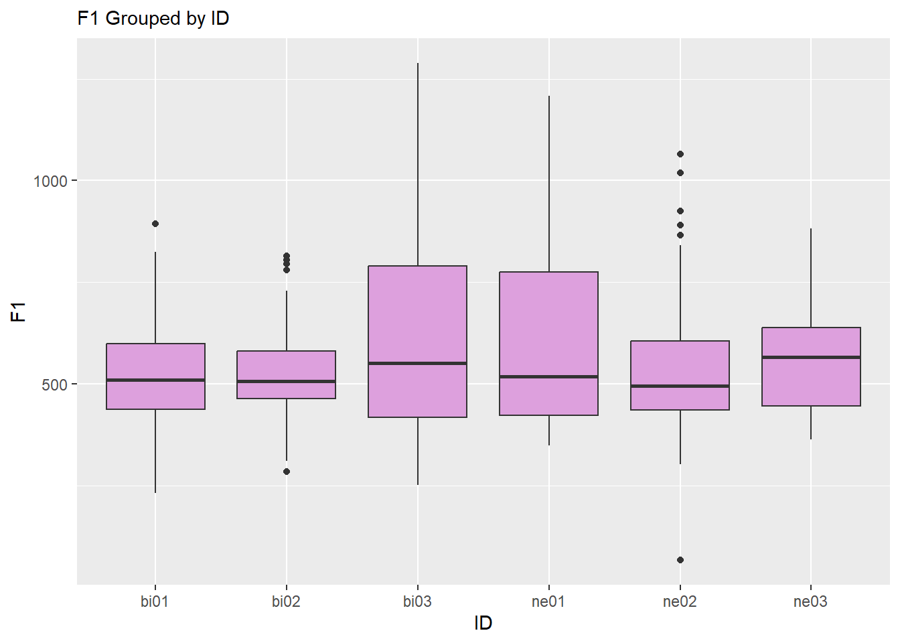
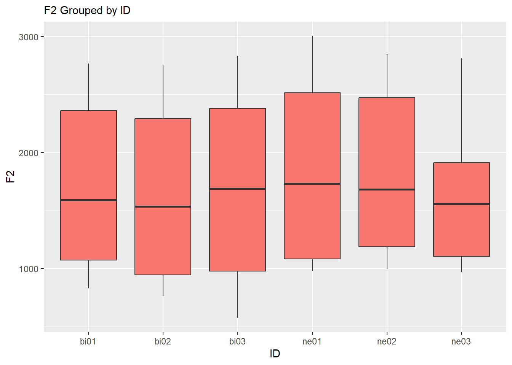
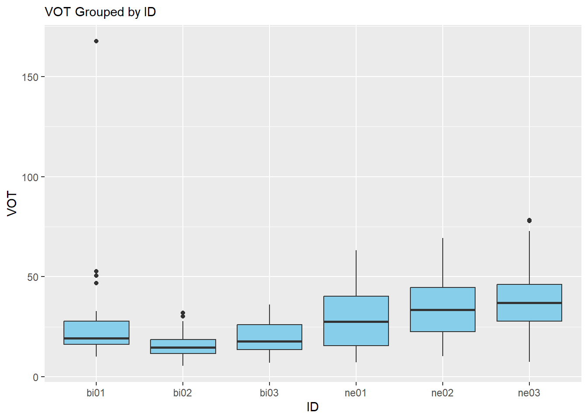

Programming assignment 4
================

**Author**: Alex Rogers  
**Date**: Last update: 2024-04-12 18:24:12.758647

# Overview

<!-- 
  Talk briefly about what you did here 
  Describe your hypotheses
-->

I’m expecting the native English speakers to have higher overall VOT
values than the bilingual speakers, since English VOT categories are in
general higher than those of Spanish. I’m honestly not entirely sure
what to expect from the F1 and F2 values. I think I remember something
about /a/ having a higher f1 than other vowels, so I’m guessing that
stimuli with /a/ in them will have higher f1 values, but I can’t
remember if that is a real thing or something I made up. I plan to look
at the statistics when grouped by participant and by word so hopefully
my data will be able to show vowel differences.

# Prep

## Libraries

## Load data

``` r
# You need to get all the files in the 'data' directory and combine them
# Check previous examples we did in class 

df <- list.files(path="../data", full.names = TRUE) %>% 
  lapply(read_csv) %>% 
  bind_rows
```

    ## Rows: 45 Columns: 5
    ## ── Column specification ────────────────────────────────────────────────────────
    ## Delimiter: ","
    ## chr (2): fileID, notes
    ## dbl (3): f1, f2, vot
    ## 
    ## ℹ Use `spec()` to retrieve the full column specification for this data.
    ## ℹ Specify the column types or set `show_col_types = FALSE` to quiet this message.
    ## Rows: 45 Columns: 5
    ## ── Column specification ────────────────────────────────────────────────────────
    ## Delimiter: ","
    ## chr (1): fileID
    ## dbl (3): f1, f2, vot
    ## lgl (1): notes
    ## 
    ## ℹ Use `spec()` to retrieve the full column specification for this data.
    ## ℹ Specify the column types or set `show_col_types = FALSE` to quiet this message.
    ## Rows: 45 Columns: 5
    ## ── Column specification ────────────────────────────────────────────────────────
    ## Delimiter: ","
    ## chr (1): fileID
    ## dbl (3): f1, f2, vot
    ## lgl (1): notes
    ## 
    ## ℹ Use `spec()` to retrieve the full column specification for this data.
    ## ℹ Specify the column types or set `show_col_types = FALSE` to quiet this message.
    ## Rows: 45 Columns: 5
    ## ── Column specification ────────────────────────────────────────────────────────
    ## Delimiter: ","
    ## chr (1): fileID
    ## dbl (3): f1, f2, vot
    ## lgl (1): notes
    ## 
    ## ℹ Use `spec()` to retrieve the full column specification for this data.
    ## ℹ Specify the column types or set `show_col_types = FALSE` to quiet this message.
    ## Rows: 45 Columns: 5
    ## ── Column specification ────────────────────────────────────────────────────────
    ## Delimiter: ","
    ## chr (1): fileID
    ## dbl (3): f1, f2, vot
    ## lgl (1): notes
    ## 
    ## ℹ Use `spec()` to retrieve the full column specification for this data.
    ## ℹ Specify the column types or set `show_col_types = FALSE` to quiet this message.
    ## Rows: 45 Columns: 5
    ## ── Column specification ────────────────────────────────────────────────────────
    ## Delimiter: ","
    ## chr (1): fileID
    ## dbl (3): f1, f2, vot
    ## lgl (1): notes
    ## 
    ## ℹ Use `spec()` to retrieve the full column specification for this data.
    ## ℹ Specify the column types or set `show_col_types = FALSE` to quiet this message.
    ## Rows: 5 Columns: 1
    ## ── Column specification ────────────────────────────────────────────────────────
    ## Delimiter: ","
    ## chr (1): data
    ## 
    ## ℹ Use `spec()` to retrieve the full column specification for this data.
    ## ℹ Specify the column types or set `show_col_types = FALSE` to quiet this message.

## Tidy data

``` r
# Convert from long to wide or wide to long format as necessary (check 
# examples from class)
# Create any other relevant variables here 
newdf <- df %>%
  separate("fileID", c("ID", "Word")) %>%
  select( -c(notes, data)) %>%
  na.omit()
```

# Analysis

## Descriptives

``` r
# Give some descriptive summaries of your data 
# Display your descriptives in a table (try knitr::kable())

wordstats <- newdf %>%
  group_by(Word) %>%
  summarize(meanF1 = mean(f1), meanF2 = mean(f2), meanVOT = mean(vot), sdF1 = sd(f1), sdF2 = sd(f2), sdVOT = sd(vot))

idstats <- newdf %>%
  group_by(ID) %>%
  summarize(meanF1 = mean(f1), meanF2 = mean(f2), meanVOT = mean(vot), sdF1 = sd(f1), sdF2 = sd(f2), sdVOT = sd(vot))

knitr::kable(wordstats,
             caption = "Descriptive stats by word")
```

| Word  |   meanF1 |    meanF2 |  meanVOT |      sdF1 |      sdF2 |     sdVOT |
|:------|---------:|----------:|---------:|----------:|----------:|----------:|
| kaka  | 791.8417 | 1658.6850 | 30.37500 | 180.53493 | 171.26708 |  9.087160 |
| kaka1 | 835.4067 | 1720.5067 | 33.94500 |  81.61172 | 266.51119 |  9.367439 |
| kaka2 | 683.8583 | 1590.5400 | 30.98167 | 349.66931 |  98.59331 |  9.103521 |
| keke  | 555.0233 | 2382.2917 | 30.45667 | 132.42640 | 173.83810 | 10.426253 |
| keke1 | 580.4250 | 2244.8717 | 30.57333 | 166.11446 | 271.21685 |  9.469018 |
| keke2 | 527.9150 | 2430.6700 | 28.67167 |  37.31621 | 162.63207 |  8.865261 |
| kiki  | 467.1033 | 2707.0433 | 35.15167 | 187.03444 |  79.41101 | 16.450153 |
| kiki1 | 459.4600 | 2525.5567 | 44.14000 | 244.42695 | 272.77297 | 23.765999 |
| kiki2 | 385.8550 | 2730.0400 | 41.55500 |  66.49718 |  90.18551 | 20.478325 |
| koko  | 568.1000 | 1010.3550 | 36.87500 |  63.29091 |  92.03013 | 15.464445 |
| koko1 | 543.8467 | 1030.0400 | 31.73333 |  55.22138 | 105.78560 |  4.804713 |
| koko2 | 602.3000 | 1064.8200 | 33.21000 | 110.71654 |  89.26945 | 12.489633 |
| kuku  | 552.9733 | 1006.4467 | 42.45167 | 188.11473 | 155.20009 | 21.580151 |
| kuku1 | 398.0233 | 1157.7950 | 43.96333 |  95.73505 | 273.87935 | 14.737045 |
| kuku2 | 490.4100 | 1243.7383 | 64.27667 | 308.23620 | 516.45822 | 52.673415 |
| paka  | 823.4567 | 1684.0117 | 13.43667 | 168.48551 | 109.69795 |  6.870775 |
| paka1 | 724.4950 | 1531.8933 | 16.47333 | 131.81229 | 205.93559 |  8.480525 |
| paka2 | 790.0883 | 1728.3733 | 11.36667 | 151.28069 | 121.32428 |  4.691877 |
| peke  | 486.7850 | 2173.4150 | 17.98500 |  55.10007 | 416.79151 | 14.771482 |
| peke1 | 534.6667 | 2449.1467 | 19.52667 | 117.56929 | 127.10112 |  8.913008 |
| peke2 | 616.4200 | 2369.6883 | 18.08333 | 171.43390 | 127.47466 | 14.289376 |
| piki  | 372.9133 | 2521.6750 | 19.33333 |  22.51014 | 414.99333 |  4.839391 |
| piki1 | 348.8350 | 2598.5617 | 20.22833 |  52.98417 | 327.42645 | 12.830712 |
| piki2 | 580.7633 | 2619.9950 | 15.72333 | 353.99501 | 239.16176 |  4.823234 |
| poko  | 570.9067 | 1039.7250 | 21.70333 |  42.30747 | 115.17614 |  7.170212 |
| poko1 | 639.2300 | 1398.5367 | 21.51167 | 194.09430 | 498.15677 |  9.297383 |
| poko2 | 528.9533 | 1120.1433 | 20.82667 |  99.21541 | 248.59054 |  9.901658 |
| puku  | 524.8833 |  977.3600 | 25.01667 | 177.90046 | 250.94310 |  3.707822 |
| puku1 | 491.4400 | 1100.7317 | 36.40167 |  93.72416 | 265.18145 | 17.076712 |
| puku2 | 440.4100 |  981.9083 | 36.24833 |  30.28917 | 163.11042 | 24.993633 |
| taka  | 783.4867 | 1693.9667 | 15.84000 |  80.48748 | 100.01989 |  6.715472 |
| taka1 | 856.8967 | 1661.3833 | 17.13833 | 183.10400 |  91.56426 |  4.535458 |
| taka2 | 679.8917 | 1514.4633 | 16.80667 | 234.87047 | 172.64114 |  3.485844 |
| teke  | 519.8783 | 2214.2133 | 20.37833 |  36.82782 | 341.25070 | 10.954846 |
| teke1 | 532.5200 | 2315.2733 | 20.41833 |  82.74694 | 225.24724 |  9.891229 |
| teke2 | 552.6483 | 1990.4433 | 17.64833 | 130.53174 | 570.55747 |  9.015916 |
| tiki  | 393.2083 | 2666.2383 | 23.27167 | 127.86645 | 220.27803 | 13.913762 |
| tiki1 | 468.5733 | 2469.1700 | 29.61833 | 229.55554 | 492.83849 | 24.978344 |
| tiki2 | 406.9517 | 2315.4317 | 27.53167 |  72.33512 | 546.83940 |  6.226940 |
| toko  | 596.1917 | 1017.1300 | 22.28500 | 110.32858 |  97.21523 | 13.931370 |
| toko1 | 583.3100 | 1091.9000 | 25.12000 | 107.66507 |  80.39930 | 13.846484 |
| toko2 | 587.5433 | 1041.5850 | 21.55333 |  97.62701 |  26.67372 |  8.008667 |
| tuku  | 499.0983 | 1007.2650 | 25.87000 |  83.50620 | 191.27009 | 15.463270 |
| tuku1 | 438.6967 |  989.8000 | 30.25167 |  29.98069 | 138.88124 | 20.028278 |
| tuku2 | 602.4333 | 1131.6767 | 28.10833 | 252.97977 | 345.05471 | 14.451089 |

Descriptive stats by word

``` r
knitr::kable(idstats,
             caption = "Descriptive stats by participant ID")
```

| ID   |   meanF1 |   meanF2 |  meanVOT |     sdF1 |     sdF2 |     sdVOT |
|:-----|---------:|---------:|---------:|---------:|---------:|----------:|
| bi01 | 520.2511 | 1727.237 | 26.19733 | 138.3988 | 666.6207 | 23.572779 |
| bi02 | 525.1749 | 1590.657 | 15.01689 | 133.0502 | 675.6050 |  6.272208 |
| bi03 | 613.8496 | 1711.959 | 19.53489 | 238.7243 | 703.8318 |  8.374591 |
| ne01 | 610.8180 | 1867.462 | 29.39378 | 236.3422 | 729.1889 | 15.607123 |
| ne02 | 545.4836 | 1843.350 | 34.03178 | 209.3634 | 649.3192 | 15.141230 |
| ne03 | 573.5051 | 1648.469 | 37.70067 | 149.8780 | 569.8071 | 16.491598 |

Descriptive stats by participant ID

## Visualization

``` r
# Include some plots here

newdf %>%
  ggplot() +
  aes(x = ID , y = f1 ) +
geom_boxplot(fill = "plum") + 
  labs( 
         subtitle="F1 Grouped by ID",
         x="ID",
         y="F1")
```



``` r
newdf %>%
  ggplot() +
  aes(x = ID , y = f2 ) +
geom_boxplot(fill = "#F8766D") + 
  labs( 
         subtitle="F2 Grouped by ID",
         x="ID",
         y="F2")
```



``` r
newdf %>%
  ggplot() +
  aes(x = ID , y = vot ) +
geom_boxplot(fill = "skyblue") + 
  labs( 
         subtitle="VOT Grouped by ID",
         x="ID",
         y="VOT")
```



<!-- 
Also include a professional looking figure illustrating an example of the acoustics 
of the production data, i.e., a plot generated in praat.
You decide what is relevant (something related to your hypothesis). 
Think about where this file should be located in your project. 
What location makes most sense in terms of organization? 
How will you access the file (path) from this .Rmd file?
If you need help consider the following sources: 
  - Search 'Rmarkdown image' on google, stackoverflow, etc.
  - Search the 'knitr' package help files in RStudio
  - Search the internet for HTML code (not recommended, but it works)
  - Check the code from my class presentations (may or may not be helpful)
-->

<figure>

<figcaption aria-hidden="true">Sample spectrogram of
bi01_kaka</figcaption>
</figure>

## Hypothesis test

``` r
# Conduct a simple statistical analysis here (optional)
```

# Conclusion

<!-- 
Revisit your hypotheses (refer to plots, figures, tables, statistical tests, 
etc.)
&#10;Reflect on the entire process. 
What did you enjoy? What did you hate? What did you learn? 
What would you do differently?
-->

The data seem to indicate that I was more or less on the right track
with my hypothesis regarding VOT values. While a drastic difference when
compared to the bi group, the native English speaking group did have
overall higher VOT values. Disregarding outliers, that is, as there is
one incredibly high VOT value from participant bi01 that cannot possibly
be accurate. One thing I didn’t hypothesize on was the formant values as
a function of speaker ID. Looking at the descriptive statistics, it
seems that native English speakers also had higher mean f1 and f2 values
on average, though there is one standout per group that seems to break
that trend. I don’t know if those differences can be attributed to
native language, bilingual status, or simply to the individual. I would
have liked to be able to create an additional column “Vowel” so that I
could analyze VOT, f1 and f1 as a function of vowel, but I couldn’t
figure out the code to do so.

</br></br>
